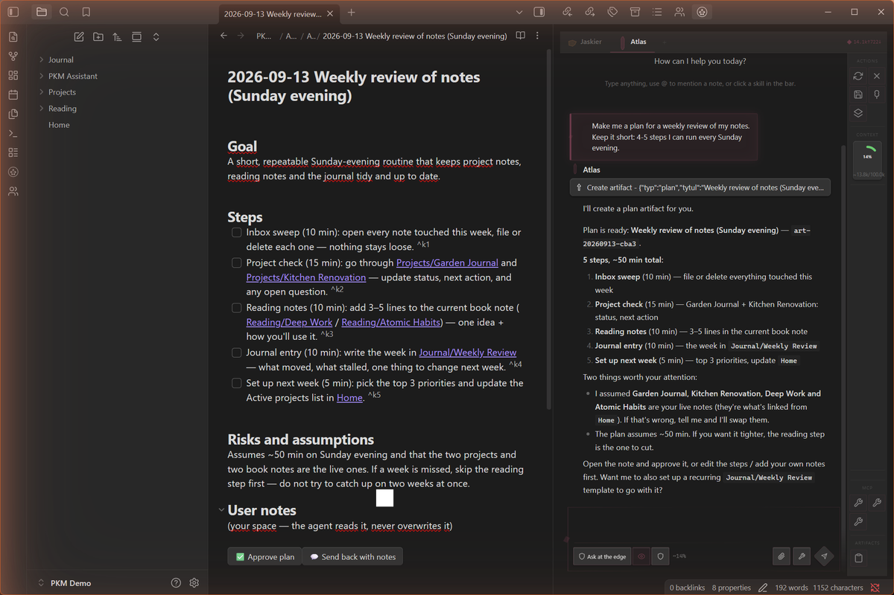
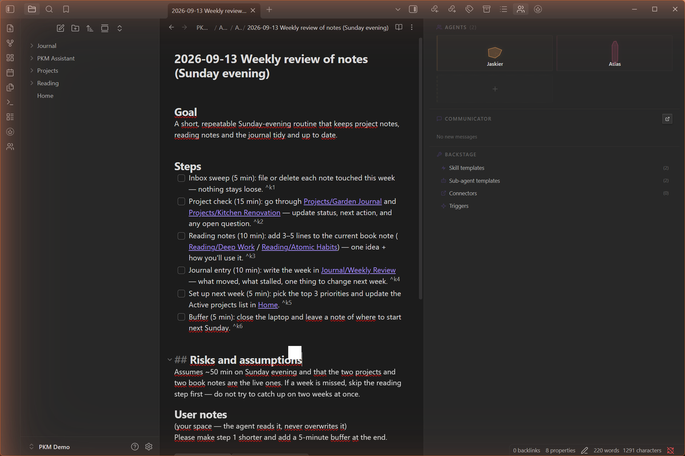
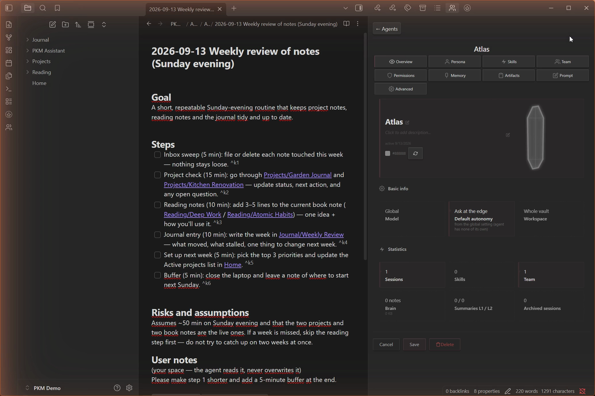
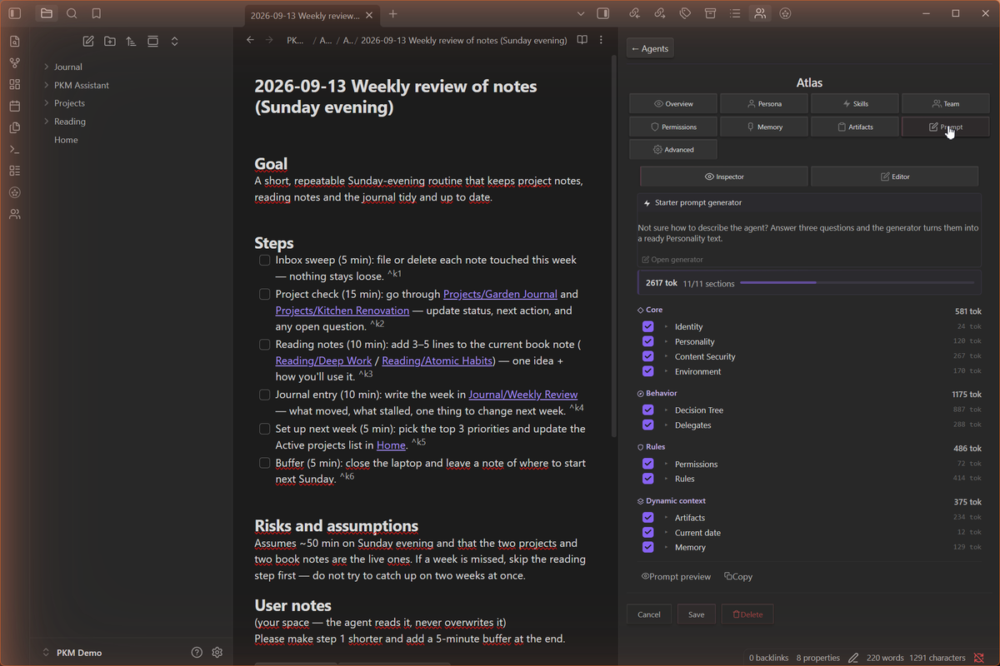

# PKM Assistant

**Build your own AI agents inside Obsidian - with full transparency and control over every part of the prompt.**

[]() [](LICENSE) []() [](https://github.com/JDHole/pkm-assistant/actions/workflows/ci.yml)



---

## What is this?

PKM Assistant is an Obsidian plugin that lets you create, customize, and run AI agents directly inside your vault. Each agent has its own personality, memory, skills, and tools - and you can see and edit **every piece of text** that gets sent to the AI model.

Most AI tools hide what happens under the hood. PKM Assistant says: *"There is no magic here. Your agent is a prompt. Here is what it is made of. Change whatever you want."*

Everything the agent sends to the model - system prompt, memory, tools, skills - is assembled from parts you can read and edit. No hidden middle layer.

---

## Screenshots

| Chat View | Agent Panel |
|:-:|:-:|
|  |  |

| Agent Profile | Prompt Inspector |
|:-:|:-:|
|  |  |

---

## Key Features

**Multi-Agent System** - Create multiple agents, each with a unique personality, role, and capabilities. Switch between them with tabs. Jaskier (built-in mentor) guides you from day one - then build your own.

**9 AI Platforms** - Anthropic, OpenAI, Google Gemini, DeepSeek, Groq, OpenRouter, xAI, Ollama, LM Studio. Use cloud models or run fully offline.

**Full Prompt Transparency** - The Prompt Inspector shows every section of the system prompt with token counts. Edit any part. No black boxes.

**Built-in MCP Tools** - Read/write notes, memory, skills, delegation, live artifacts, web search (5 providers), image generation, audio STT, agent-to-agent mail. Plus external MCP servers (stdio/HTTP) you connect yourself.

**Sub-Agent Delegation** - Agents delegate research and strategy tasks to cheaper/smaller models, saving tokens while maintaining quality.

**Skills & Playbooks** - Teach your agents reusable procedures. Skills are markdown files - easy to create, share, and version.

**Deep Research** - Two factory skill templates (web + vault) orchestrate parallel research workers and deliver a living report note with verbatim quotes: URLs for web research, wikilinks (plus knowledge blind spots) for vault research. Reports are artifacts - reopen one and summon the agent to dig deeper.

**Persistent Memory v3** - Each agent has its own brain index, durable memory notes, session archive, and cascading summaries (L1/L2/L3). Context carries across sessions.

**Multi-Modal** - Vision input, image generation (6 platforms), audio speech-to-text (6 platforms).

**Orama Retrieval** - Semantic and text search across your vault using the v2 embedding module and Orama.

**Security** - AccessGuard, path traversal protection, sensitive data masking, per-agent approval system.

**Extended Thinking** - Thinking/reasoning blocks across all supported platforms.

**Bilingual UI** - Full Polish and English interface with ~1000 translation keys.

---

## Installation

### Option A: BRAT (recommended)

1. Install [BRAT](https://github.com/TfTHacker/obsidian42-brat) from Obsidian Community Plugins
2. In BRAT settings, click **Add Beta Plugin**
3. Enter: `https://github.com/JDHole/pkm-assistant`
4. Enable **PKM Assistant** in Settings → Community Plugins

### Option B: Manual (ZIP)

1. Download the latest release from [Releases](https://github.com/JDHole/pkm-assistant/releases)
2. Extract `main.js`, `manifest.json`, and `styles.css` into:
   ```
   your-vault/.obsidian/plugins/pkm-assistant/
   ```
3. Restart Obsidian
4. Enable **PKM Assistant** in Settings → Community Plugins

### Option C: Community plugins (after approval)

The plugin is not in Obsidian's community catalogue yet - submission is planned.
If it is accepted, you will be able to install it straight from
Settings → Community plugins → Browse. Until then, use Option A (BRAT) or Option B (ZIP).

### Requirements

- Obsidian 1.11.0+
- An API key for at least one AI platform - **or** [Ollama](https://ollama.com/) for fully local, free operation
- For local embeddings: Ollama with `snowflake-arctic-embed2` model

---

## Quick Start

1. **Set up a model** - There's no first-launch wizard: on first start you'll see a short notice pointing you to Settings. Open Settings → PKM Assistant → Klucze API (API Keys) and add a key for a cloud platform (OpenRouter, DeepSeek, Anthropic, or any supported platform) - or set a local Ollama/LM Studio server address for fully local, free operation.

2. **Meet Jaskier** - Your default mentor agent. He knows the entire system and will walk you through the features, help you configure models, and create your first custom agent.

3. **Explore the sidebar** - Agents, Communicator (agent-to-agent mail, stored as plain Markdown in your vault - local only, nothing leaves your machine), Backstage (skill and sub-agent templates, connectors).

4. **Start chatting** - Type anything. Use `@` to mention a note from your vault. Use the autonomy control (YOLO / Ask at the edge / Ask about everything) to decide when the agent checks with you before acting.

---

## Built-in Agent

**Jaskier** (Mentor) - your default orchestrator. He knows the entire system, guides you through features, helps configure models, and walks you through creating your first custom agent.

From there, create unlimited custom agents with their own personalities, roles, skills, memory, and tool access.

---

## Network Use, Accounts & Privacy

**No telemetry.** This plugin collects no analytics and sends nothing to the author. It never checks for or installs its own updates - that is handled by Obsidian's community plugin catalogue (or by BRAT, if you installed it that way). Background connections happen only for features you have configured yourself: vault indexing when you select a cloud embedding provider, and external MCP servers you marked as autostart. Everything else is the direct result of an action you take.

**Your content goes only to providers you configure.** When you use chat, semantic search indexing, web search, speech-to-text, or image generation, the relevant content (chat messages, note excerpts, attachments, search queries, audio) is sent to the provider you explicitly selected in settings. Until you configure a provider and use a feature, nothing leaves your vault.

Depending on your configuration, the plugin can connect to:

- **Chat models:** Anthropic, OpenAI, Google Gemini, DeepSeek, Groq, OpenRouter, xAI - or local Ollama / LM Studio (`localhost`).
- **Embeddings (semantic search):** OpenAI, Google Gemini - or local Ollama / LM Studio.
- **Web search:** Jina AI (works without an API key), Tavily, Brave Search, Serper.dev, or a self-hosted SearXNG instance. Page reading via Jina Reader.
- **Speech-to-text:** OpenAI Whisper, Groq, Google Speech, Deepgram, AssemblyAI - or local Ollama.
- **Image generation:** OpenAI, Stability AI, Replicate, Google Gemini, xAI, OpenRouter.

**Fully local operation is possible:** chat and embeddings via Ollama or LM Studio, web search via self-hosted SearXNG - no cloud account required.

**API keys** are stored locally in the plugin's settings file inside your vault (`.pkm-assistant/settings.json`, with a `settings.last-good.json` fallback and daily backups in `.pkm-assistant/backups/`) and are sent only to the corresponding provider. Treat your vault folder as sensitive if you sync or share it.

**Accounts & payment:** cloud providers require your own account and API key; most are paid (some offer free tiers). The plugin itself is free and open source (GPL-3.0).

**External MCP servers (advanced, opt-in):** you can connect external MCP tool servers - local processes (stdio) or remote endpoints (HTTP). These run outside the plugin's control; install only servers you trust.

**What the plugin does outside your vault** (this is the complete list, and every item happens only when you click the corresponding button):

- **Starts local processes** only for stdio MCP servers you added yourself (the `command` you configured). Nothing is spawned otherwise.
- **Reads one file outside the vault:** Claude Desktop's `claude_desktop_config.json` (from its default location, `%APPDATA%\Claude` on Windows; otherwise a file picker opens), only when you click *Import from Claude* in the external MCP servers settings, to copy your existing server definitions. The file is read, never written.
- **Uses the system clipboard** only for explicit copy actions: copying a chat message, an agent's prompt, or an exported agent profile.

Everything else - notes, memory, settings, indexes - stays inside your vault folder.

---

## Security

- **API keys** stored in the vault's `.pkm-assistant/settings.json` (not in plugin code)
- **AccessGuard** protects system folders (`.obsidian`, `.trash`)
- **No arbitrary code execution** - executable custom JS tools were removed in v2.2. Custom tools run as external MCP servers (separate processes or HTTP endpoints) that you explicitly configure - install only servers you trust.
- **Path traversal protection** - blocks `../`, URL-encoded sequences, null bytes, zero-width unicode
- **Sensitive data masking** - API keys detected and masked in logs
- **Agents cannot access** the OS filesystem or spawn processes; network access is limited to your configured providers. External MCP servers you explicitly add run as separate OS processes.
- **Approval system** - per-tool notifications with context, per-agent toggles

### Why the Adapter API

All agent data (profiles, skills, memory, sessions, artifacts, settings) lives in a hidden
folder inside your vault: `.pkm-assistant/`. Obsidian's `Vault` API does not index dotted
folders, so `getAbstractFileByPath()` returns `null` for every file there - the plugin has to
read and write them through `app.vault.adapter`, which is the supported API for exactly this
case. Regular user notes are still handled through the normal `Vault` API.

Because the adapter takes raw strings instead of `TFile` objects, every path an agent or a
tool call supplies goes through the plugin's own `sanitizePath()` first.
It is stricter than Obsidian's `normalizePath()`: it rejects `../` traversal (including
URL-encoded and double-encoded forms), null bytes, zero-width unicode, Windows reserved
names, over-long paths and segments, and it blocks a fixed list of protected paths
(settings file, backups, logs, agent session folders) from ever being opened by a tool.

---

## Architecture

```
core/                # Foundation: plugin base class, runtime, HTTP transport, security, i18n, utils
modules/
├── agent-loop/      # Shared tool-calling loop (used by chat + sub-agents)
├── agents/          # Agent profiles, AgentManager, Jaskier (built-in mentor)
├── artifacts/       # Live plans/todos with an approval flow
├── chat/            # Chat view, streaming, rolling memory window, inline triggers
├── crystal-soul/    # Design system (SVG icons, skins, color generation)
├── embedding/       # Orama vector index + embedding providers
├── komunikator/     # Agent-to-agent mail (plain Markdown files, local only)
├── memory/          # Per-agent Memory v3 (brain index, durable notes, sessions, summaries)
├── models/          # Chat model providers (9 platforms) + provider registry
├── multimodal/      # Vision input, image generation, audio speech-to-text
├── onboarding/      # Setup-wizard code (disabled since v2.0; kept as a skeleton for v3)
├── prompts/         # PromptBuilder + Decision Tree (behavior rules)
├── shell/           # Settings tab, sidebar, misc modals
├── skills/          # Skill engine (reusable agent procedures, Markdown-based)
├── sub-agents/      # Sub-agent delegation: loader, runner, templates
├── tools/           # 23 built-in MCP tools + external MCP client (stdio/HTTP)
├── ui-components/   # Shared chat UI primitives (tool calls, thinking blocks, attachments)
└── web/             # Web search providers + URL provenance tracking
src/
├── main.ts          # Composition root (plugin entry point)
└── styles.css
```

Agent data lives in your vault:
```
.pkm-assistant/
├── agents/          # Agent YAML profiles + playbooks + per-agent memory and sessions
├── sub-agents/      # Sub-agent configs + knowledge bases
├── skills/          # Skill markdown files
├── mcp-servers/     # External MCP server definitions
├── komunikator/     # Agent-to-agent mail
├── artifacts/       # Live plans and research reports
├── skins/           # Custom UI skins
├── logs/            # Plugin log files
├── backups/         # Daily settings backups
└── settings.json    # Plugin settings (API keys)
```

---

## Building from Source

```bash
git clone https://github.com/JDHole/pkm-assistant.git
cd PKM-Assistant
npm install
npm run build        # Production build → main.js
npm run dev          # Watch mode for development
npm test             # Run 3023 unit tests (AVA)
npm run typecheck    # tsc --noEmit (TypeScript strict)
```

`npm test` needs one more thing: a clone of
[pkm-assistant-harness](https://github.com/JDHole/pkm-assistant-harness) next to this repo (or a
`PKM_ASSISTANT_HARNESS` environment variable pointing at one). The `obsidian` module stub and DOM
shim that the unit tests run against live there, not in this repo's `test-support/` - a small
locator script under that same path finds the clone and hands off to it. Missing it fails fast
with a message naming exactly what to clone.

The integration harness (the real plugin booted in Node without Obsidian - offline agent loop,
34 scenario tests) lives in its own repository:
[pkm-assistant-harness](https://github.com/JDHole/pkm-assistant-harness). Clone it next to this
one and follow its README.

The production bundle is a single `main.js` of roughly 2.1 MB; the plugin boots in about
0.1 s (measured with the offline harness dry-boot).

---

## Tech Stack

| Component | Technology |
|-----------|-----------|
| Language | TypeScript, strict mode (100% of the source) |
| Platform | Obsidian Plugin API (Electron/Node.js) |
| Bundler | esbuild (single `main.js`, ~2.1 MB) |
| Tests | AVA (3023 unit tests) + an offline harness that boots the real plugin in Node |
| AI Protocol | MCP (Model Context Protocol) |
| Design | Crystal Soul v2 (SVG + CSS variables, 62 colors) |
| Embeddings | Ollama + snowflake-arctic-embed2 (local, 1024 dims) |

---

## Roadmap

### Near-term
- Manual test plan completion (202 tests)
- ZIP/repo distribution for Discord beta testers
- README, onboarding improvements

### Future
- Mobile (responsive UI, touch, lazy loading)
- Advanced memory (adaptive retrieval, cross-agent memory)
- Agent debates (multiple agents in one chat)
- Marketplace (agents, skills, MCP servers)

---

## How it was built

This project is 100% **vibe-coded**. The author (JDHole) is not a programmer. All code - 367 TypeScript source files (tests excluded), 23 built-in tools, 19 modules - was written across ~114 sessions working with AI, primarily **Claude** via the **Claude Code** extension for VS Code.

---

## Bug Reports

1. What you were doing (step by step)
2. What happened vs. what should have happened
3. Console output: `Ctrl+Shift+I` → Console tab → screenshot of errors (red)
4. Which AI model you were using

File issues at [GitHub Issues](https://github.com/JDHole/pkm-assistant/issues).

---

## Credits

- **Author:** [JDHole](https://github.com/JDHole) (concept, vision, prompt engineering, testing)
- **AI Developer:** Claude (Anthropic) via Claude Code

---

## License

Copyright (C) 2026 Jakub Dziura

PKM Assistant is free software: you can redistribute it and/or modify it under the terms of the GNU General Public License as published by the Free Software Foundation, either version 3 of the License, or (at your option) any later version. It is distributed WITHOUT ANY WARRANTY; see the full text in [LICENSE](LICENSE) (GPL-3.0-or-later).

Licences of the libraries bundled into `main.js`: [THIRD-PARTY-LICENSES.md](THIRD-PARTY-LICENSES.md).
